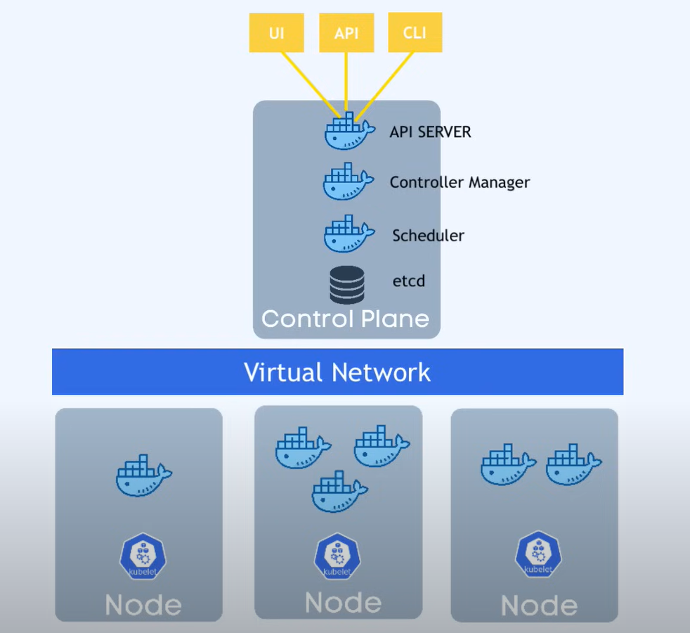

# 🏗️ Kubernetes Architecture

## 🧩 1️⃣ Struttura di base

Un **cluster Kubernetes** è composto da:

* 🔹 **Almeno un Master Node**
* 🔹 Più **Worker Nodes** collegati al Master

---

## ⚙️ 2️⃣ Worker Nodes 🚜

💡 **Cosa succede sui Worker Nodes?**

* Ogni Worker Node esegue un processo chiamato **Kubelet** 🔄

  * 👉 Il **Kubelet** permette ai nodi di comunicare tra loro.
  * 📌 Si occupa di eseguire **task** come far partire i container delle applicazioni.

* 🗂️ Ogni Worker Node ospita **container di diverse applicazioni**.

  * A seconda del carico di lavoro, ogni nodo avrà un diverso numero di **container Docker** attivi.
  * 💪 Qui avviene **il vero lavoro**: le tue app girano sui Worker Nodes.

---

## 🧑‍💼 3️⃣ Master Node 🎛️

💡 **Cosa fa il Master Node?**

Il Master Node gestisce i **processi principali** di Kubernetes, fondamentali per il funzionamento del cluster:

### 🔑 Principali processi sul Master Node:

1️⃣ **API Server 📡**

* È l’**entry point** del cluster Kubernetes.
* È un container che riceve richieste da:

  * 🖥️ Dashboard UI
  * ⚙️ API (da script o automazioni)
  * 🖱️ CLI (strumenti da riga di comando)

2️⃣ **Controller Manager 👮‍♂️**

* Monitora costantemente lo stato del cluster.
* Si occupa di:

  * Riparare risorse se serve.
  * Riavviare container morti.
  * Mantenere coerenza.

3️⃣ **Scheduler 📅**

* Si occupa di **assegnare i container ai Worker Nodes**.
* Lo fa in base a:

  * Risorse disponibili su ciascun nodo.
  * Carico di lavoro richiesto.
* 📌 È un processo **intelligente** che ottimizza la distribuzione.

4️⃣ **etcd (Key-Value Storage) 🗃️**

* Contiene lo **stato corrente del cluster**.
* Salva:

  * Configurazioni.
  * Stato di ogni nodo e container.
* 🛡️ È la base per il **backup e restore**: grazie agli **etcd snapshots** puoi ripristinare l’intero cluster.

---

## 🌐 4️⃣ Virtual Network 🌐

🔗 Tutti i nodi (Master + Worker) sono connessi tramite una **Virtual Network**:

* 📡 Questa rete **mette in comunicazione tutti i nodi**.
* 💪 Trasforma i nodi in **un’unica macchina virtuale** con la somma delle risorse di tutti i nodi.

---

## ⚖️ 5️⃣ Risorse: Worker vs Master

📌 Nota importante:

* 🗄️ **Worker Nodes** → Hanno **più risorse** perché eseguono **centinaia di container**.
* 🎛️ **Master Node** → Ha bisogno di meno risorse (esegue solo una manciata di processi), ma è **critico** per il cluster:

  * Se perdi l’accesso al Master Node 👉 **Non puoi più gestire il cluster!**
  * 🔒 **Backup obbligatorio!**

---

## 🔐 6️⃣ Alta disponibilità del Master

👉 Nei **sistemi di produzione**:

* Si usano **almeno 2 Master Nodes**.
* 🔁 Se uno va giù, gli altri Master Nodes garantiscono la continuità dell'intero cluster.
* 🔒 Questo evita **interruzioni di servizio**.

