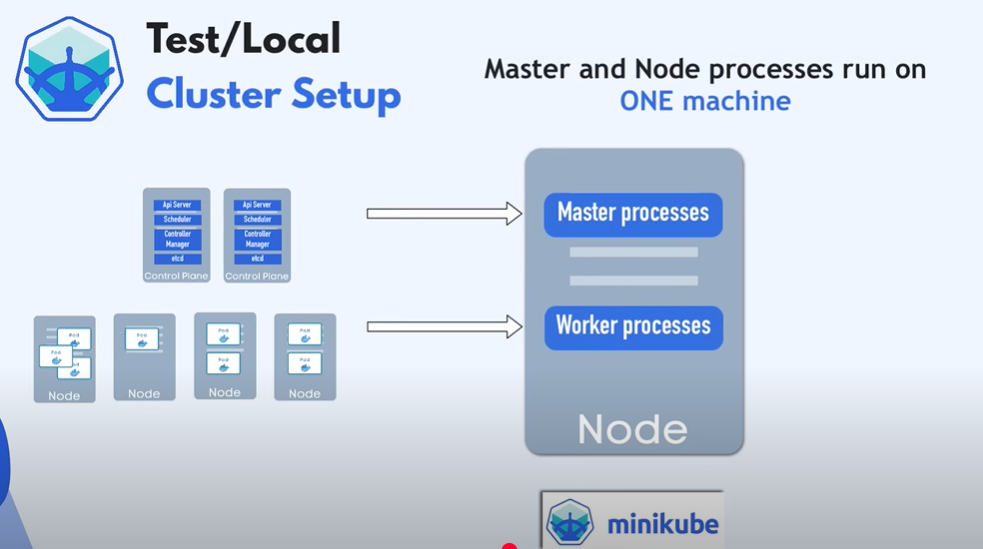
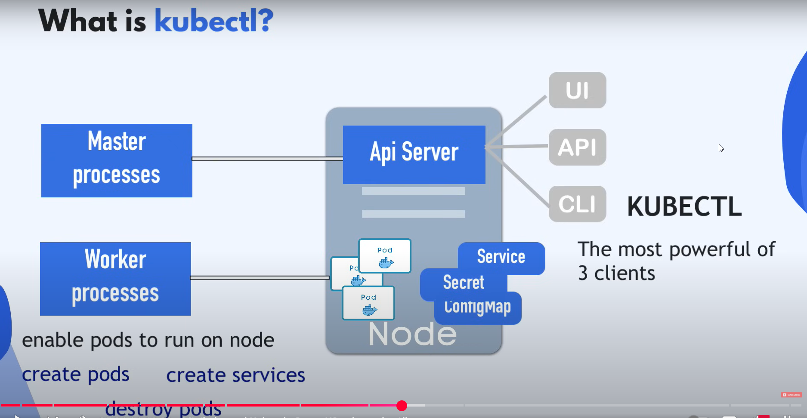

# 🧩 Minikube & Kubectl — Setup di un cluster Kubernetes **locale**

---

## 🚀 1️⃣ Cos’è **Minikube**?

💡 **Minikube** è uno strumento open-source per eseguire un **cluster Kubernetes** sul tuo **PC locale**.

✅ **Perché usarlo?**

* In produzione avresti:

  * Più **Master Nodes** (minimo 2).
  * Più **Worker Nodes**.
* Ma riprodurre questa architettura su un PC è **impraticabile** per motivi di risorse (CPU, RAM). DAto che avremo effetivamente macchine virtuali o fisiche separate.

👉 **Minikube** risolve questo problema creando:

* Un **cluster a nodo singolo**.
* Dove **Master Processes** e **Worker Processes** girano sullo stesso nodo.



---

## ⚙️ 2️⃣ Come funziona Minikube?

🔹 Minikube include:

* 🔄 Un **runtime container** Docker **preinstallato**.
* ⚙️ Esegue container e Pod **sul nodo virtuale locale**.

---

## 🧰 3️⃣ Cos’è **Kubectl**?

* Ora che abbiamo tale nodo virtuale sulla nostra macchina virtuale, che rappresenta minikube, abbiamo bisogno di un modo per interagire con tale cluster per creare pods e altri componenti kubernetes su tale nodo.

✨ **Kubectl** è il **CLI ufficiale** di Kubernetes.

✅ Serve per:

* 🗂️ **Creare Pod**, Service, Deployment, ecc.
* 🗑️ Eliminare risorse.
* 📊 Controllare lo stato del cluster.

💡 Con **kubectl** puoi fare **tutto** ciò che faresti da UI o API, ma via riga di comando.

---

## 🔗 4️⃣ Come comunicano Minikube e Kubectl?

📌 Ricorda:

* Minikube esegue sia i **processi Master** che i **processi Worker**, incluso l’**API Server** (che è un processo master).

* **API Server** è in realtà il punto di ingresso principale nel kubernetes cluster. Quindi se vogliamo fare qualsiasi cosa in kubernetes, creare qualisiasi componente, dobbiamo prima parlare con il **API server** e il modo per parlare con il API Server è tramite diversi client, quindi tramite UI Dashboard, o tramite le API kubernetes (script o curl) o tramite comman line interface CLI cioè **Kubectl**.

* Kubectl è il più potente tra i tre diversi clients perchè con Kubectl possiamo fare qualsiasi cosa che vogliamo in Kubernetes

* Kubectl invia **comandi** all’API Server:

  * Esempio: `kubectl apply -f deployment.yaml`
* L’API Server li inoltra ai **processi Worker**, che eseguono:

  * Creazione Pod.
  * Scalabilità.
  * Eliminazione risorse.



✅ **Kubectl funziona con qualsiasi cluster Kubernetes**:

* Cloud (es. GKE, EKS, AKS).
* Cluster on-prem.
* Cluster ibridi.

* **Kubectl** è lo strumento da utilizzare per interagire con qualsiasi tipo di kubernetes cluster.
---

## ⚙️ 5️⃣ Installare Minikube & Kubectl

[minikube installation](https://minikube.sigs.k8s.io/docs/start/?arch=%2Fwindows%2Fx86-64%2Fstable%2F.exe+download)

### 📌 Prerequisiti:

* 2 CPUs or more
* 2GB of free memory
* 20GB of free disk space
* Internet connection
* Minikube richiede di girare come:

  * 🐳 **Container** oppure
  * 📦 **VM**
* Serve un **driver** (es. Docker, VirtualBox).

---

### 🧩 Installazione Minikube (esempio con Windows)

1️⃣ Usa **Powershell come amministratore**:

```bash
minikube start
```
* Minikube deve avviarsi o come container o come VM, quindi abbiamo bisogno di un container tool (docker, cri-o ecc.) o di un VM tool (vmware, oracle virtualmachine) installato sul nostro computer per eseguire minikube. Questo sarà il driver per Minikube. 

2️⃣ Avvia un cluster:

✨ **Nota:**

* Docker è il **driver consigliato** su Linux, Mac e Windows.

* L'isolamento Minikube in realtà viene fornito con docker già installato per eseguire i container. Ma docker come driver da minikube significa che stiamo ospitando minikube sulla nostra macchina locale come un container docker stesso. Quindi abbiamo due livelli di docker. Minikube in esecuzione è un container docker e all'interno di minikube abbiamo docker confezionato in minikube per eseguire i nostri container di applicazioni e per ospitare minikube sul nostro computer possiamo usare docker, quindi se abbiamo già installato docker sulla nostra macchina siamo pronti ad avviare un minikube kluster in caso contrario dobbiamo installarlo.

* Non confonderti: Docker viene usato **due volte**:

  1. Minikube gira **come container Docker** sul tuo PC.
  2. Dentro Minikube, Docker esegue **i container dell’applicazione**.

```bash
minikube start --driver docker
```

---

### 🐳 Se non hai Docker:

* Scarica **Docker Desktop** da [Docker Hub](https://www.docker.com/).
* Installa e avvia il **daemon Docker**.
* Ora puoi usare Docker come **driver Minikube**.

---

## ✅ 6️⃣ Verifica il cluster

✨ Dopo `minikube start`:

* Controlla stato:

  ```bash
  minikube status
  ```

* Usa **kubectl** (già installato con Minikube):

  ```bash
  kubectl get nodes
  ```

📌 Vedrai:

PS C:\Users\felip> minikube status
minikube
type: Control Plane
host: Running
kubelet: Running
apiserver: Running
kubeconfig: Configured

* 1 nodo = **control-plane + worker**
* Stato, versione Kubernetes, data aggiunta al cluster.

---

## 🔑 7️⃣ Workflow consigliato

| Strumento    | Funzione                                                   |
| ------------ | ---------------------------------------------------------- |
| **Minikube** | Avvia cluster locale, lo arresta o lo elimina              |
| **Kubectl**  | Configura e gestisce TUTTO: Pod, Deployment, Service, Logs |

---

## 🚀 8️⃣ Cosa puoi fare ora?

* Kubectl viene installato come dipendenza quando installiamo Minikube

PS C:\Users\felip> kubectl get node
NAME       STATUS   ROLES           AGE   VERSION
minikube   Ready    control-plane   23m   v1.33.1

* Il comando di sopra ci mostra tutti i nodi nel cluster. Nel nostro caso abbiamo solo un nodo che è il **Control Plane** che è il nodo worker allo stesso tempo

Con Minikube + Kubectl puoi:

* 🛠️ **Testare applicazioni** Kubernetes in locale.
* 📦 Fare prove di Deploy, Scaling, ConfigMap, Volumes.
* 🧪 Simulare ambienti **prod** senza infrastruttura cloud.

---

## ✅ 9️⃣ Buone pratiche

* 📂 **Versiona i manifest YAML** → Repository Git.
* 🔄 Usa `minikube stop` per arrestare e `minikube delete` per pulire.
* 📌 Non usare Minikube per prod → È solo per test e sviluppo locale!

---

## 🎉 Ora sei pronto!

➡️ Hai un cluster **Kubernetes locale** pronto per fare pratica!
➡️ Puoi **interagire solo con `kubectl`** → È lo **strumento principale** per tutto!
