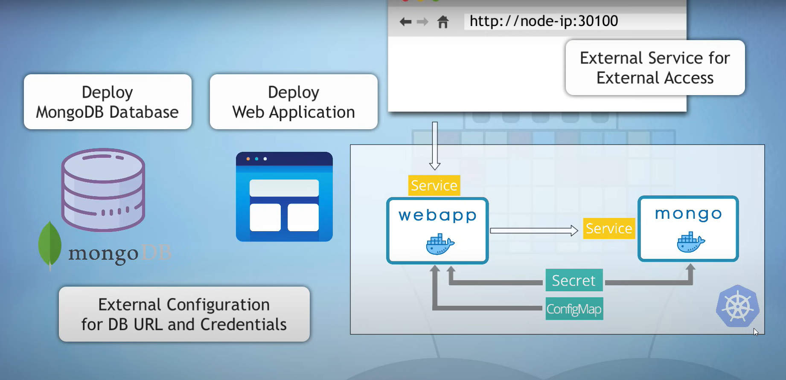
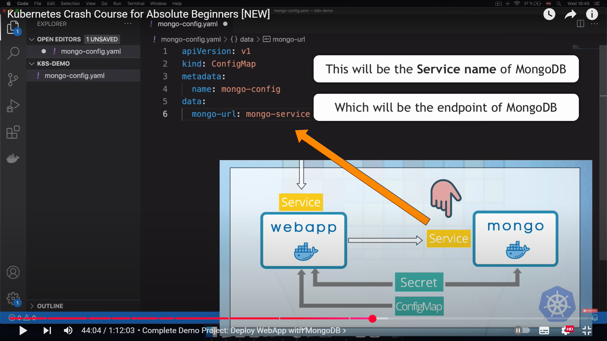
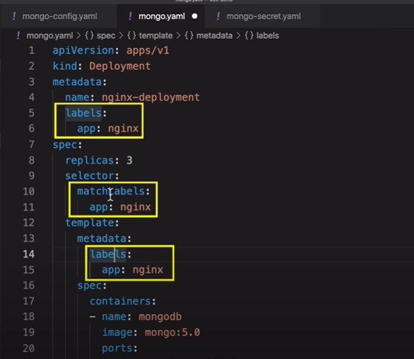
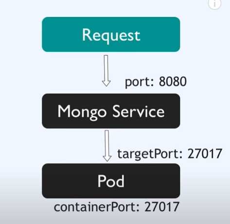
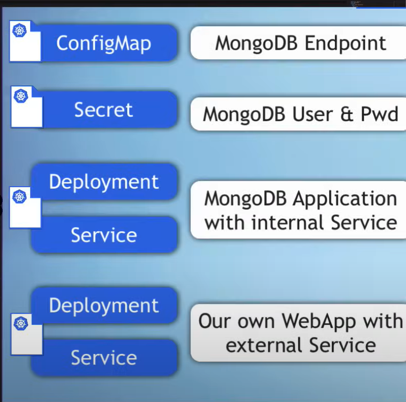
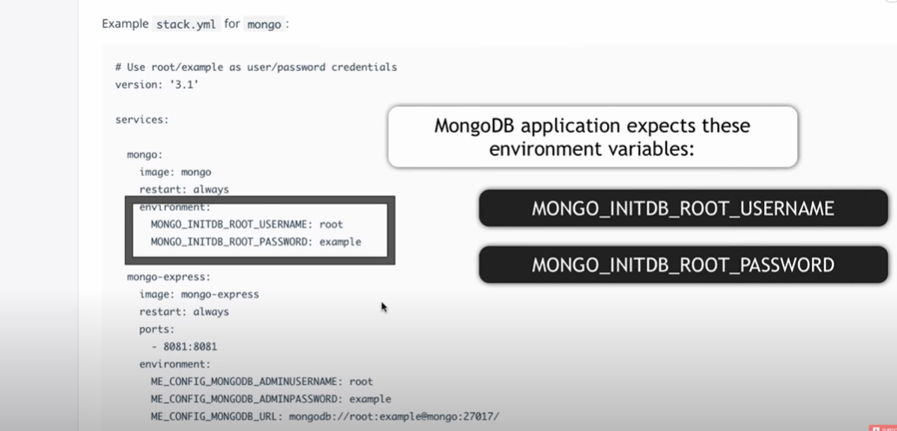
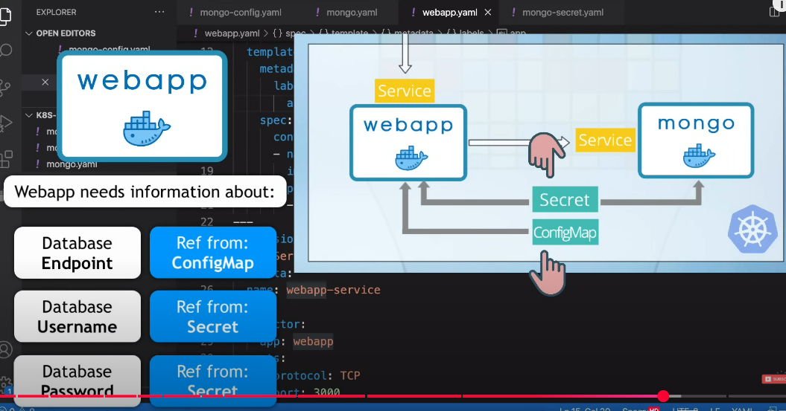

# 🚀 **Complete Demo Project — Deploy WebApp with MongoDB**

---

## 📌 **Obiettivo del progetto**

In questa demo pratica:

* Deploy di **MongoDB** 🗄️ come database.
* Deploy di una **Web Application** 🌐 che si connette a MongoDB.
* Uso di:

  * 🔑 **Secret** → credenziali DB.
  * 🗂️ **ConfigMap** → endpoint DB.
  * 🔗 **Service** → connessione e bilanciamento.
  * 🌍 **NodePort** → accesso esterno via browser.



---

## 🧩 **1️⃣ Risorse necessarie**

* **Documentazione Kubernetes** → Per sintassi YAML.
* **Docker Hub** → Contiene l’immagine della WebApp pubblica.

---

## 📂 **2️⃣ Struttura dei file**

* Per prima cosa andiamo avanti e creiamo tutti i file di configurazione di kubernetes di cui abbiamo bisogno per il deploy della configurazione della nostra applicazione.

In una cartella `kubernetes-demo`:
1️⃣ `mongo-config.yaml` → ConfigMap (URL DB) con l'endpoint del MongoDB
2️⃣ `secret.yaml` → Secret (username/password DB)
3️⃣ `mongo.yaml` → Deployment + Service MongoDB, Per distribuire l'applicazione MongoDB ed il suo servizio.
4️⃣ `webapp.yaml` → Deployment + Service WebApp, per distribuire la nostra applicazione demo ed il suo servizio.

---

## ⚙️ **3️⃣ Creazione ConfigMap**

**File:** `mongo-config.yaml`

```yaml
apiVersion: v1
kind: ConfigMap
metadata:
  name: config
data: # mettiamo tutte le coppie chiave-valore che definiamo come configurazione esterna all'interno di questa ConfigMap. Nel nostro caso ne abbiamo una sola 
  mongo-url: mongodb-service (come valore mettiamo il servizio che creeremo per l'applicazione mongodb e che chiameremo tale servizio "mongo-service")
```



✅ Contiene:

* `mongo-url`: nome del **Service** di MongoDB.
* Serve come **endpoint** per la WebApp.

---

## 🔐 **4️⃣ Creazione Secret**

**File:** `mongo-secret.yaml`

* Conterrà lo username e password per l'applicazione monogodb.

```yaml
apiVersion: v1
kind: Secret
metadata:
  name: secret
type: Opaque
data:
  user: <base64-username>
  password: <base64-password>
```

📌 **Nota:**

* I valori devono essere codificati in **Base64**:

  ```bash
  echo -n "myusername" | base64
  echo -n "mypassword" | base64
  ```

* Ora quando creiamo deployments (distribuzioni) per le nostre applicazioni possiamo fare riferimento a uno qualsiasi dei valori definiti nella secret o nella configMap, vediamo come funziona.

---

## 🗄️ **5️⃣ Deployment + Service MongoDB**

* Creiamo il file di configurazione in cui creeremo il deployment e il servizio per MongoDB, Possiamo creare file separati per questi ma è una cosa molto comune metterli assieme dato che tutti i deployment necessitano di servizi.

* Spighiamo il deployment step by step

**File:** `mongo.yaml`

```yaml
apiVersion: apps/v1
kind: Deployment
metadata:
  name: mongodb-deployment
  labels: 
    app: nginx
spec:
  replicas: 1
  selector:
    matchLabels:
      app: mongodb
  template: # la parte principale del deployment, la quale definisce il blueprint per i pods. Tale blueprint è definito come un Template. Il template in sostanza è una configurazione del pod all'interno della configurazione del deployment. Dunque il template configura effetivamente il pod all'interno di un deployment.
    metadata:
      labels:
        app: mongodb
    spec: # nella specifica del pod abbiamo la definizione dei containers, quindi questo è una lista di containers che come abbiamo imparato possiamo avere più containers in un pod ma pricipalmente abiamo un'applicazione per pod e qui definiamo quale immagine verrà utilizzata per creare questo pod
      containers:
      - name: mongodb # nome che noi diamo al container
        image: mongo:5.0
        ports:
        - containerPort: 27017 # porta dove il container ascolterà
```

* I **labels**:



- In kubernetes possiamo dare a qualsiasi componente una coppia chiave-valore labels. Dunque possiamo etichettare qualsiasi cosa, dal pod al deploymnet alla configmap ecc. I  labels in sostanza sono identificatori aggiuntivi dei componenti oltre al nome. Quindi possiamo identificare e indirizzare componenti specifici usanod le loro etichette.

- Perchè ne abbiamo bisogno? Quando abbiamo più repliche dello stesso pod ogni pod avrà un nome univoco, tuttavia possono condividere la stessa etichetta (label), quindi possiamo identificare tutte le repliche dei pods della stessa applicazione usando un'etichetta specifica che tutte le repliche condividono. Per questo nei metadati del pod abbiamo sempre la chiave label. Quindi per i pods i labels sono un campo obbligatorio per altri componenti come deployment, configmap ecc. i labels sono facoltative ma è buona pratica impostarle.

- Ora, quando creiamo le repliche dei pod come fa deployment a sapere quali pods gli appartengono effetivamente o come fa kubernetes a sapere quali pods appartengono a quali deploymennts? è per questo che serve la parte **Selector**. Il **selector** -> **matchLabels** sono nelle specifiche del deployment e definiscono che tutti i pods che corrispondono al **matchLabel** appartengono a questo deployment. Dunque anche a questo servono i labels dei pods nel template.

- Le coppie chiave: valore dei labels possono essere qualsiasi nome che decidiamo dargli. Tuttavia buona pratica in kubernetes è usare la chiave **app** 


- Infine, abbiamo l'attributo **replicas** che definisce quanti pods vogliamo creare utilizzando questo blueprint. Nel nostro caso usiamo solo 1 replica perchè è un database e come sappiamo se vogliamo scalare i database in kubernetes dovremmo usare un Stateful e non un deployment. Per mantenere tutto semplice ci atterremo a una replica e questa è in sostanza la nostra configurazione del deployment di mongodb e il pod blueprint

```yaml
apiVersion: apps/v1
kind: Deployment
metadata:
  name: mongo-deployment
  labels:
    app: mongo
spec:
  replicas: 1
  selector:
    matchLabels:
      app: mongo
  template:
    metadata:
      labels:
        app: mongo
    spec:
      containers:
      - name: mongodb
        image: mongo:5
        ports:
        - containerPort: 27017

```

- Ora aggiungiamo la configurazione del **Service** dato che ogni applicazione ha bisogno di un Servizio in kubernetes e questa sarà una unità yaml separata e la separiamo usando tre trattini.

- Il nome del **Service** (mongo-service) è l'endpoint che useremo per accedere a mongo

- Nella specigicatio abbiamo attributi specifici del service. Innanzitutto abbiamo l'attributo **selector** di cui abbiamo bisogno in **Service** perchè il **service** deve inoltrare la richiesta che riceve ai suoi pod endpoints. Coome fa il **service** a sapere quali pod gli appartengono e a quali deve inoltrare le richieste? Lo sa utilizzando lo stesso label selector che abbiamo visto in deployment, quindi nel **selector** deve corrispondere all'etichetta (labels) dei pods che apparterranno al servizio che è **mongo**. In questo modo **service** ed i pods si troveranno a vicenda.

- **ports**, il **service** è accessibile all'interno del cluster utilizzando il proprio indirizzo IP e la porta.

- **targetPort**, è la porta dei pods che appartengono al **service**, e logicamente, la targetPort deve sempre essere la stessa della porta del container **containerPort**, questo perchè è lì che è accessibile l'applicazione nel pod. è lì che il **service** deve inoltrare la richiesta

- Recap delle **ports**: l'attributo **port** imposta la porta del **service** e **targetPort** indica al service a quale porta deve inoltrare la richiesta ai pods, questa deve essere la stessa porta del container

- è uno standard comune assegnare sia alla porta del service che al targetPort lo stesso valore sebbene possono essere diversi



```yaml
apiVersion: apps/v1
kind: Deployment
metadata:
  name: mongo-deployment
  labels:
    app: mongo
spec:
  replicas: 1
  selector:
    matchLabels:
      app: mongo
  template:
    metadata:
      labels:
        app: mongo
    spec:
      containers:
      - name: mongodb
        image: mongo:5
        ports:
        - containerPort: 27017
---
apiVersion: v1
kind: Service
metadata:
  name: mongo-service
spec:
  selector:
    app: mongo
  ports:
    - protocol: TCP
      port: 27017
      targetPort: 27017

```

* Ora abbiamo la nostra configurazione per il deployment di mongodb e il service



---

## 🌐 **WebApp Deployment & Service**

**File:** `webapp.yaml`

* Creiamo il deployment e service per la nostra web application

```yaml
apiVersion: apps/v1
kind: Deployment
metadata:
  name: webapp-deployment
  labels:
    app: webapp
spec:
  replicas: 1
  selector:
    matchLabels:
      app: webapp
  template:
    metadata:
      labels:
        app: webapp
    spec:
      containers:
      - name: webapp
        image: nanajanashia/k8s-demo-app:v1.0 # l'immagine della nostra web application
        ports:
        - containerPort: 3000
---
apiVersion: v1
kind: Service
metadata:
  name: webapp-service
spec:
  selector:
    app: webapp
  ports:
    - protocol: TCP
      port: 3000
      targetPort: 3000
```

✅ Questa è la configurazione base per **Deployment** and **Service** per ogni applicazione in kubernetes cluster.

---

## **Pass Secret Data to Mongo Deployment**

* Abbiamo un'altra cosa da configurare nei nostri componenti di deployment, sia per mongo che per la webapp, ovvero dobbiamo passare i dati definiti nei componenti di configurazione (configMap) e di Secret.

* Prima di tutto quando si avvia un'applicazione MongoDB dobbiamo impostare lo **username** e **password**, quindi quando l'applicazione MongoDB si avvia genererà automaticamente lo username e la password per MongoDB e possiamo quindi usarli per accerdervi nel nostro cluster.

* Come facciamo a sapere come possono essere configurati lo username e password in un MongoDB all'avvio? Andiamo, nella documentazione della immagine e vediamo le variabili d'ambiente per lo username e password e questi sono in realtà campi obbligatori nella maggior parte dei database, dibbiamo quindi impostarli altrimenti non potremo accedervi 




* Ora, come configuriamo le variabili d'ambiente in un container configuration? quindi come passiamo le variabili d'ambiente a questa applicazione in esecuzione all'interno del container?   Utilizziamo la'ttributo **env** nella configurazione del deployment

* **env**: inseriamo una lista di variabili di ambiente  con -name: value:. Dove il name è il nome della variabile d'ambiete e value è il valore della variabile d'ambiente.

* Nel nostro caso vogliamo usare come valori delle variabili di ambiente quelli presenti in **Secret**. Quindi usiamo **valueFrom** e **secrteKeyRef** dove mettiamo il nome della Secret (mongo-secret) e **key** dove mettiamo la chiave che ha come valore lo username o la password nel nostro Secret. 

```yaml
apiVersion: apps/v1
kind: Deployment
metadata:
  name: mongo-deployment
  labels:
    app: mongo
spec:
  replicas: 1
  selector:
    matchLabels:
      app: mongo
  template:
    metadata:
      labels:
        app: mongo
    spec:
      containers:
      - name: mongodb
        image: mongo:5.0
        ports:
        - containerPort: 27017
        env: 
        - name: MONGO_INITDB_ROOT_USERNAME
          valueFrom: 
            secretKeyRef:
              name: mongo-secret
              key: mongo-user 
        - name: MONGO_INTDB_ROOT_PASSWORD
          valueFrom: 
            secretKeyRef: 
              name: mongo-secret
              key: mongo-password 
---
apiVersion: v1
kind: Service
metadata:
  name: mongo-service
spec:
  selector:
    app: mongo
  ports:
    - protocol: TCP
      port: 27017
      targetPort: 27017
```

* Ora il nostro file di comfigurazione per MongoDB è completo

---

## **Pass Config Data to WebApp Deployment**

* Quando la nostra applicazione web si avvia, dovrà connettersi al database, quindi dobbiamo dare alla applicazione web informazioni riguardo all'endpoint del database, dove può accedere al database e quale username e password utilizzare per l'autenticazione con il database



* La webapp si aspetta queste informazioni come variabili di ambiente 

* Nell'immagine che usiamo, scaricata da docker hub, per la webapp è già stata configurata per aspettarsi tutti questi valori come variabili di ambiente con i nomi specifici (USER_NAME, USER_PWD e DB_URL (per l'endpoint del database))

* Passiamo questi pezzi di dati (informazioni) come variabili d'ambiente alla webapp

* In questo modo non abbiamo nessuno dei valori delle variabili di ambiante nei nostri file di configurazione di kubernetes, ma abbiamo solamente i riferimenti ad essi, i che rende la nostra configuration molto più pulita. Se qualcosa cambia o i valori delle variabili cambiamo non dobbiamo cambiare niente nei deployments ma solo nel **configMap** e nel **Secret**

```yaml
apiVersion: apps/v1
kind: Deployment
metadata:
  name: webapp-deployment
  labels:
    app: webapp
spec:
  replicas: 1
  selector:
    matchLabels:
      app: webapp
  template:
    metadata:
      labels:
        app: webapp
    spec:
      containers:
      - name: webapp
        image: nanajanashia/k8s-demo-app:v1.0 # l'immagine della nostra web application
        ports:
        - containerPort: 3000
        env:
        - name: USER_NAME
          valueFrom:
            secretKeyRef: 
              name: mongo-secret
              key: mongo-user
        - name: USER_PWD
         valueFrom:
          secretKeyRef:
            name: mongo-secret
            key: mongo-password
        - name: DB_URL # il valore di tale variabile di ambiente non è in secret ma in configMap
          valueFrom: 
            configMapKeyRef:
              name: mongo-config
              key: mongo-url            
---
apiVersion: v1
kind: Service
metadata:
  name: webapp-service
spec:
  selector:
    app: webapp
  ports:
    - protocol: TCP
      port: 3000
      targetPort: 3000
```

---

# 🌐 **Accesso esterno con NodePort & Deploy finale**

---

## ✅ **1️⃣ Obiettivo finale**

📌 Dopo aver configurato:

* Database **MongoDB** 🗄️
* WebApp  🌐
* **ConfigMap** & **Secret** 🔐

Devi rendere la WebApp **accessibile da browser**. Dobbiamo essere in grado di digitare un URL e accedere alla nostra applicazione web dal browser.
👉 Per farlo, usi un **Service esterno** (External Service) (`type: NodePort`).
* Al momento entrambe le nostre configurazioni di deployment della webapp e di mongoDB sono servizi interni. Per renderli **External Service** quello che dobbiamo fare è impostare un Type che per default è clusterIP (se non viene specificato). Ma noi lo imposteremo a NodePort.

* NodePort è un tipo di External Service e richiede una terza porta che si chiama **nodePort**. Questa è una porta che si aprirà su nodi kubernetes su cui l'applicazione sarà accessibile. Quindi sull'indirizzo IP del nodo cobianata con la nodePort (<NodeIP>:<NodePort>) saremo in grado di accedere a questo servizio che quindi accederà ai pods dietro di esso. L'intervallo di nodePort è effettivamente definito in kubernetes, quindi non possiamo semplicemente digitare qualsiasi porta ma deve essere compreso tra 30000 e 32767. Qualsiasi valore compreso in questo intervallo va bene

```yaml
---
apiVersion: v1
kind: Service
metadata:
  name: webapp-service
spec:
  type: NodePort
  selector:
    app: webapp
  ports:
    - protocol: TCP
      port: 3000
      targetPort: 3000
      nodePort: 30100
```

* Questo completa la configurazione della webapp

---

## ⚙️ **2️⃣ ClusterIP vs NodePort**

| Tipo                    | Funzione                                                         |
| ----------------------- | ---------------------------------------------------------------- |
| **ClusterIP** (default) | Accessibile **solo internamente** al cluster.                    |
| **NodePort**            | Espone il Service all’**esterno** del cluster (es. dal browser). |


## 🔌 **Come funziona NodePort**

* 🌍 Apre una **porta fissa** su **ogni nodo**.
* 🔗 La combinazione `http://<Node-IP>:<NodePort>` raggiunge il Service.
* 📡 Il Service **gira la richiesta** ai Pod dietro le quinte.

---

### 🔹 Step-by-step:

* Ora abbiamo una configurazione molto semplice ma anche abbastanza realistica per il deployment di una applicazione con il suo database con configurazione esterna nel cluster. 

* Come passaggio finale creeremo tutti questi componenti uno per uno in kubernetes

* Minikube is runnig ma i componenti non sono ancora deployati al suo interno

* Per prima cosa dobbiamo creare le configurazioni esterne perchè devono essere prsenti quando creiamo i deployments di mongodb e della webapp dato che fanno riferimento a tali configurazioni

```bash
# 1️⃣ Crea ConfigMap
kubectl apply -f mongo-config.yaml

# 2️⃣ Crea Secret
kubectl apply -f secret.yaml

* Creiamo per prima il deployment di mongodb dato che la nostra webapp dipende da questa

# 3️⃣ Crea MongoDB (Deployment + Service (inquesto caso solo interno))
kubectl apply -f mongo.yaml

# 4️⃣ Crea WebApp (Deployment + NodePort Service (anche per accesso esterno dal cluster))
kubectl apply -f webapp.yaml
```

---

## 🔍 **7️⃣ Controllo**

Controlla tutto:

```bash
kubectl get all
kubectl get pods
kubectl get services
```

✅ Verifica:

* Tutti i Pod devono essere `Running`.
* Il Service `webapp-service` deve mostrare `NodePort`.

---

## 🌍 **8️⃣ Accesso dal browser**

```bash
PS C:\Users\felip\Desktop\kubernetes\kubernetes-demo> kubectl get svc
NAME             TYPE        CLUSTER-IP       EXTERNAL-IP   PORT(S)          AGE
kubernetes       ClusterIP   10.96.0.1        <none>        443/TCP          27m
mongo-service    ClusterIP   10.103.209.191   <none>        27017/TCP        3m11s
webapp-service   NodePort    10.99.211.46     <none>        3000:30100/TCP   3m4s
```

* Vediamo che possiamo accedere al servizio della webapp tramite la porta 30100 con il Browser. Ma quale IP address è accessibile sul nodo?

NodePort service è sempre accessibile all'indirizzo IP di ogni nodo del cluster, quindi tutti i nodi worker del cluster, nel nostro caso ne abbiamo solo uno che è il minikube, quindi abbiamo bisogno dell'IP addres del minkube. per ottenerlo facciamo:

```bash
PS C:\Users\felip\Desktop\kubernetes\kubernetes-demo> minikube ip
192.168.49.2

PS C:\Users\felip\Desktop\kubernetes\kubernetes-demo> kubectl get node -o wide
NAME       STATUS   ROLES           AGE   VERSION   INTERNAL-IP    EXTERNAL-IP   OS-IMAGE             KERNEL-VERSION                       CONTAINER-RUNTIME
minikube   Ready    control-plane   39m   v1.33.1   192.168.49.2   <none>        Ubuntu 22.04.5 LTS   5.15.153.1-microsoft-standard-WSL2   docker://28.1.1
```

✨ Apri:

```
http://192.168.49.2:30100
```
 * Ecco che abbiamo la nostra webapp la quale è connessa a mongodb

* Tuttavia nel nostro caso siccome usiamo dokcer su WSL non funziona solo dando l'IP e la porta al brower, ci accediamo alla webapp usando:

```bash
PS C:\Users\felip\Desktop\kubernetes\kubernetes-demo> minikube service webapp-service 
|-----------|----------------|-------------|---------------------------|
| NAMESPACE |      NAME      | TARGET PORT |            URL            |
|-----------|----------------|-------------|---------------------------|
| default   | webapp-service |        3000 | http://192.168.49.2:30100 |
|-----------|----------------|-------------|---------------------------|
🏃  Starting tunnel for service webapp-service.
|-----------|----------------|-------------|------------------------|
| NAMESPACE |      NAME      | TARGET PORT |          URL           |
|-----------|----------------|-------------|------------------------|
| default   | webapp-service |             | http://127.0.0.1:64221 |
|-----------|----------------|-------------|------------------------|
🎉  Opening service default/webapp-service in default browser...
❗  Because you are using a Docker driver on windows, the terminal needs to be open to run it.
```

---

## 🧩 **9️⃣ Risultato**

* App distribuita 🚀
* Database collegato 🔗
* Config sicura 📦
* Accesso esterno 🌐

---

## 🎉 **Ora sei pronto!**

Questo è un **setup realistico** per testare Kubernetes in locale usando:

* **Minikube** 🐳
* **Kubectl** ⚙️
* Best practices: separazione config, credenziali sicure, persistenza DB.
